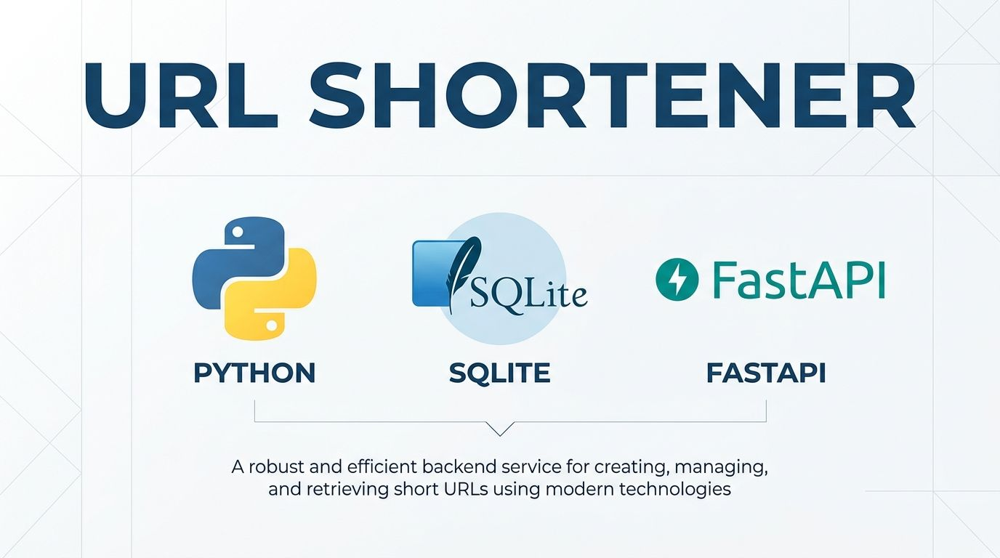

# URL Shortener



Simple URL shortener API using FastAPI and SQLite.

## Estructura (Hexagonal)

```
src/
├── domain/           # Core business logic
│   ├── entities.py   # Url dataclass
│   ├── services.py   # UrlShortenerService
│   └── utils.py      # base62_converter
├── ports/             # Interfaces
│   └── repository.py # UrlRepository ABC
└── adapters/          # Implementations
    ├── inbound/api.py        # FastAPI endpoints
    └── outbound/sql_adapter.py  # SQLite adapter

test/
├── test_services.py
└── test_utils.py
```

## Setup

```bash
python -m venv venv
source venv/bin/activate  # Mac/Linux
pip install -r requirements.txt
```

## Run

```bash
uvicorn src.adapters.inbound.api:app --reload
```

API disponible en: http://localhost:8000

## Endpoints

- `GET /` - Health check
- `POST /convert_url` - Acorta una URL
  ```json
  { "url": "https://example.com" }
  ```
- `GET /{alias}` - Redirect a la URL original

## Tests

```bash
pytest test/ -v
```
